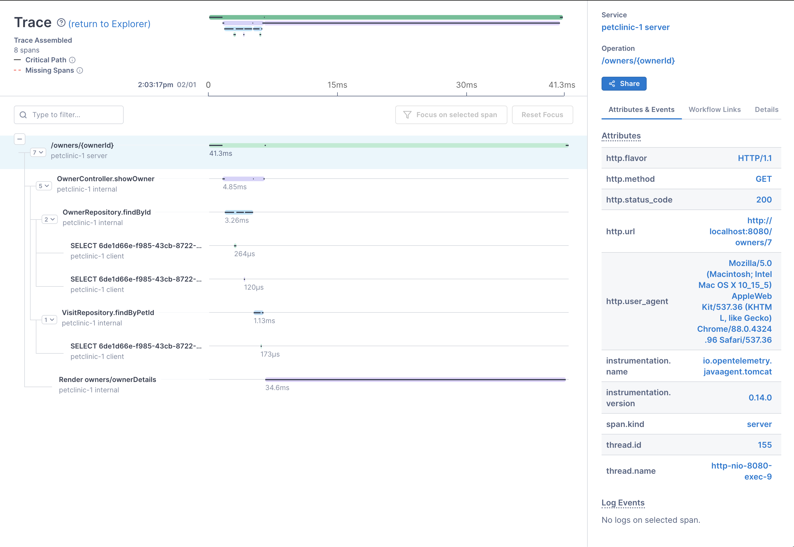

# OpenTelemetry Java Basics

This is a basic client/server for playing with OpenTelemetry in Java and learning all of the basic API calls. The code is very simple and heavily commented; it makes for a good source if you are looking for a place to copypasta OpenTelemetry patterns from.

Handy links:

* Get a [Free Lightstep Developer Account](https://app.lightstep.com/signup/developer?signup_source=tyjavabasics). For this example, a Lightstep account is needed to see your data.
* OTel Java Launcher: https://github.com/lightstep/otel-launcher-java/
* Quickstart Guide: https://opentelemetry.lightstep.com/java
* OpenTelemetry Java: https://github.com/open-telemetry/opentelemetry-java

## Setup
Define your Lightstep Access Token prior to running the app. You can find your access token under "settings" in the Lightstep UI.

```sh
export LS_ACCESS_TOKEN=<YOUR ACCESS TOKEN GOES HERE>
```

Build:

```sh
make
```

Run the server and wait for it to be ready:

```sh
make run-server
```

Run the client to perform a few requests:

```sh
make run-client
```


## Auto-instrumentation: Java Spring example

The code in this repo shows how to decorate a simple Servlet with OpenTelemetry
calls to teach you how to manually instrument your code. But if you are using a 
supported framework like spring, you get a lot of auto-instrumentation out of the box.

Let's take (Pet Clinic)[https://github.com/spring-projects/spring-petclinic], an
example Spring app, and add OpenTelemetry to it.

First, set up Petclinic:

```sh
git clone https://github.com/spring-projects/spring-petclinic.git
cd spring-petclinic
./mvnw package
```

Then, fetch the Lightstep Launcher for Java. The Launcher is a distro of the
OpenTelemetry Java Agent that is pre-configured to talk to Lightstep:

```sh
curl -L -O https://github.com/lightstep/otel-launcher-java/releases/download/0.14.0/lightstep-opentelemetry-javaagent-0.14.0.jar
```

Use env vars to add your Lightstep access token and to correctly name your service.

```sh
export LS_ACCESS_TOKEN=<YOUR ACCESS TOKEN GOES HERE>
export LS_SERVICE_NAME=petclinic
```

With that, you're ready to start petclinic locally, with the Launcher attached as 
a Java agent.

```sh
java -javaagent:lightstep-opentelemetry-javaagent-0.14.0.jar -jar target/*.jar
```

After petclinic starts, go to [http://localhost:8080/](http://localhost:8080/) and
interact with it a bit.

* [Add an Owner](http://localhost:8080/owners/new)
* [Add a Pet](http://localhost:8080/owners/1)
* [Find Owners and edit them](http://localhost:8080/owners/find)
* [Create some errors](http://localhost:8080/oups)

After you've messed around a bit, have a look at the data by clicking on the
Explorer in Lightstep. You'll see a number of spans; click on any of them to see
a trace.

Notice how much information is automatically available:



### Exercise
All of this out of the box information is great, but you can decorate it further by using the OpenTelemetry API. Using the example code in this repo as a guide, try to do the following:

* Add the first and last name of the owner to the `OwnerController.showOwner` span as attributes. Notice that you can now search by these attributes in Lightstep.
* When the new owner form is not filled out correctly, set the status of the `OwnerController.processCreationForm` span to ERROR. Notice that errors now appear in Lightstep when you submit a new owner form without filling in all the fields.
* Add the owner name to other operations that deal with owners. Write a helper method on the Owner model that adds this information to the current span, so that you can adjust what owner attributes are added in a centralized place. Use the helper method in your controllers.
* How can might you use Spring features, such as interceptors, to help manage OpenTelemetry? For example, how would you add more span attributes to your controllers without having to put them directly in your application code?  

Thanks for checking out this tutorial! Any questions, [please start a discussion](https://github.com/tedsuo/otel-java-basics/discussions/). Bugs or other problems? Please [file an issue](https://github.com/tedsuo/otel-java-basics/issues). Hope it was helpful. :)
